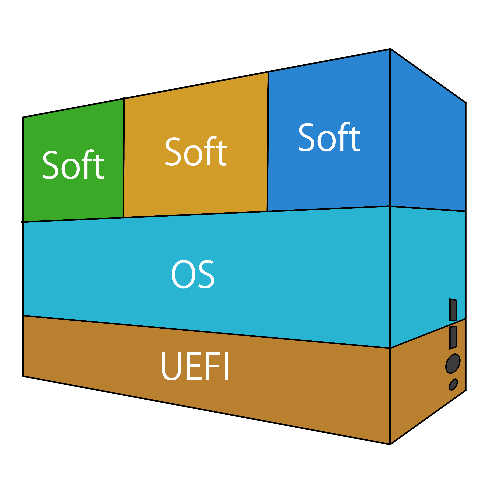

# UEFIチュートリアル
## 必要な物
1. WindowsPC
1. PC操作の基本
1. C言語の簡単な知識
2. 新品のUSBメモリ（データの内容は消えます）
3. セキュアブートが無効化できるPC

### あると便利な物
1. サブのPC

### 注意事項
本文書に対しての何らかの保証はなく、内容に基づくいかなる結果に対しても一切の責任を負いません。

## ソフトウェアが動くまで

### OSとは
皆さんは普段Windowsを使っていると思います。そしてインターネットで調べ物をしたければWindowsを起動してからブラウザを起動すると思います。
私はこれを不思議だと思います。それはなぜでしょうか？
考えてみてください。私は調べ物をするためにブラウザを起動したいわけです。別にWindowsを起動したいわけではありません。なぜブラウザを起動するためにWindowsを起動しなければいけないのでしょうか？邪魔ですね！

そんな不思議なWindowsの存在意義を説明したいと思います。Windwosはブラウザ以外のソフトウェアを同時に起動できるようにしたりセキュリティを守る役割を担っています。例えば音楽を聞きながらゲームをするといった事はよくある事があると思います。この時ゲームとブラウザを同時起動できるように二つのソフトウェアを管理してくれているのがWindowsです。

ちなみにWindowsというのはMicrosoftが開発・販売している物ですが競合他社製品としてUbuntuやAndroidなどの製品があります。これらの事をOSと呼びます。これはプリウスやフェアレディZに対する車のような物です。

### UEFIとは
OSがソフトウェア管理などを行ってくれることが分かりました。つまりはソフトウェアの起動はOSが行っています。ですがOSは誰が起動するのでしょうか？それはUEFIです。それでは何故UEFIがOSを起動しているのでしょうか？それはUEFIが管理する対象にあります。OSはソフトウェアの管理をメインとしますがUEFIはハードウェアの管理をメインとします。例えば電圧を下げたりファンのスピードを変えたりです。この様にハードウェアとOSを分割することにより多様性を高めています。



## UEFIでアプリケーションを動かそう。

### なぜUEFIなのか？
UEFIは上記の通りOSよりも下にあり、情報が少ない分野です。ですがUEFIはOS起動までの仕事を担っておりその役割は単純ですが重要です。そんなUEFIアプリケーションを作ることを通じてセキュリティやプログラム実行の仕組み・C言語について深く学べる数少ない教材であり、各ソフトウェアの国産化を目指すのであれば決して無視できない領域です。

### WSLのセットアップ
Windows Subsystem for Linux 通称WSLという機能があります。今回はこれを用いて作業をしていきます。そこでまずWSLのセットアップを行う必要があります。2023年1月現在ではMicrosoft Storeの検索からWSLを検索しWindows Subsystem for Linuxをインストール後にUbuntuと検索をしUbuntuもインストールします。更に機能の追加から仮想マシンプラットフォームを有効化しましょう。この３つのインストールが終わったら再起動をして完了です。

### Ubuntuの起動
WSLとUbuntuのインストールが終わったらUbuntuを起動していきます。初回起動時にユーザー名とパスワードの設定を求められるのでこのパスワードを忘れずに覚えておいてください（パスワード入力中は＊＊＊など入力のサインはありません）。

### 各種環境設定
セットアップが終了したら

``` bash
git clone https://github.com/takayuki2001/LowLevelUefiKit.git
cd LowLevelUefiKit/tutorial/
```
を実行します。

次に
``` bash
sudo ./setup.sh
make setup
```
を実行します。もしもパスワード入力が求められた場合は初回起動時に設定したパスワードを入力してください。

それが終わったら
``` bash
make hello_world
```
を実行しUEFIアプリケーションを起動できます。

### UEFIアプリケーションにおける文字表示のプロセスを確認しよう。
\\wsl$\Ubuntu\home\user_name\LowLevelUefiKit
をExplorerのアドレスバーに入力するとWindows上でフォルダを開く事が出来ます。

そしてその中にあるmain.cを開いてみましょう。

まずIncludeから確認をしていきます。
#include "efi_headers/type_define.h"
#include "efi_headers/system_table.h"
この二つのみがインクルードされています。
まず上部のtype_define.hでは型のtypedefが大量に並んでいます。
又、INやOUTといった修飾子マクロも定義されています。

system_table.hでは構造体が定義されています。詳細は後述します。

ここで注目したいのはstdio等の標準ライブラリは一切使用されていない事です。

次に来るのはグローバル変数
EFI_SYSTEM_TABLE *gSystemTable;
です。

これはsystem_table.hで定義されているEFI_SYSTEM_TABLEのポインタです。

次はEfiMain関数です。これは通常のmain関数に相当します。
EFI_STATUS EFIAPI EfiMain (IN EFI_HANDLE ImageHandle, IN EFI_SYSTEM_TABLE *SystemTable)
通常であれば引数へのポインタが渡されますがUEFIアプリケーションではEFI_HANDLEとEFI_SYSTEM_TABLEへのポインタがマザーボードより渡されます。

次は
gSystemTable = SystemTable;
です。これは単純にグローバルにポインタを保存しています。

次にここで文字列を表示しています。
gSystemTable->ConOut->OutputString(gSystemTable->ConOut, L"Hello LowLevelUefiKit");
EFI_SYSTEM_TABLE構造体のConOut(EFI_SIMPLE_TEXT_OUTPUT_PROTOCOL)のOutputString関数を呼び出しています。

尚この関数はtypedefで定義されておりEFI_SYSTEM_TABLEからの相対位置に関数の実態があることが分かります。

その後は終了防止のwhile (1){}とreturnが定義されています。

これでUEFIアプリケーションの完成です！おめでとうございます。

## UEFIでアプリケーションを実機で動かそう

### USBメモリのセットアップ
まずUSBメモリをFAT32でフォーマットする必要があります。
1. ディスクの管理を起動します。
1. 上部に表示されているボリューム一覧を確認します。 
2. USBメモリをPCに差します。
3. 上部に表示されているボリューム一覧に指したUSBメモリが追加されます。
4. 追加された名前を参考に下部のディスク一覧からUSBメモリを探します。
5. 青色のボリュームがある場合は右クリックでボリューム一を削除し続けます。（削除できないボリュームは無視で構いません。）
6. 黒色になった部分を選択し右クリックから新しくシンプルボリュームを作成をクリック
7. 次へを３回押しファイルシステムをFAT32にします。
8. 次へを押して完了を押します。
9. エクスプローラーにさっき作ったボリュームが出現するのでそのボリュームを開きます。
10. その中にEFIフォルダを作成。その中にBOOTフォルダを作成します。
11. そのBOOTフォルダの中に\\wsl$\Ubuntu\home\user_name\LowLevelUefiKit\内にあるBOOTX64.EFIを移動します。

これで準備が出来ました！
USBをPCに差して起動してみましょう。

起動の仕方はWindowsの設定からWindowsUpdateを開き詳細オプションを開き回復を開きPCの起動をカスタマイズを押します。

再起動したらデバイスの使用を選択しEFI USB　Deviceを選択します。

Hello LowLevelUefiKitが表示されたら成功です。

もし表示されなければセキュアブートを無効にしましょう！

（セキュアブートの無効化方法は機種によってかなり違います。その為PCを購入したお店やメーカーに問い合わせをしてください。）

### 何故セキュアブートの無効化が必要か？
まずセキュアブートとは信頼された企業や団体以外のUEFIアプリケーション実行を拒否するものです。

拒否する必要性はWindowsを暗号化して金銭要求するようなUEFIアプリケーションがあったとします。通常であればOSのセキュリティ機能などで検出がなされます。ですがUEFIアプリケーションはOSのセキュリティ機能の影響を受けません。その為UEFIアプリケーション悪さし放題なのです。これでは問題なので特定の企業や団体以外が作ったUEFIアプリケーションの実行はデフォルトで拒否されています。

### セキュアブートの問題点と使い方
世の中にはWindwos以外のOSが複数あります。その中で特に無料のものなどはセキュアブートに対応していない事があります。その為必然的にセキュアブートを無効化して使うことになりますが、セキュアブートが無効だと悪いUEFIアプリケーションが動く可能性があります。そこでUEFIには信頼する特定の企業や団体を自分で追加できる機能が用意されています。そのような機能を駆使すれば安心してWindwos以外のOSを使うことが出来ます。

## UEFIで他の機能を呼び出してみよう

### 遂に内製化!!
ここからはUEFIの他の機能をいつくか紹介していきます。
一般的なOSでは起動時のみUEFIを活用し、起動が始まったらOS自身がUEFIを頼らずにキーボードやマウスを管理します。つまりUEFIの機能を多く使いません。ですがこれはOSだから自前管理が必要なのであり特定用途に向けたUEFIアプリケーションではこれらの機能を上手く使うことによって国産化をすることが出来ます。しかも簡単に！！その為に代表的なUEIF機能をいくつか紹介してみようと思います。

（本当に一部なので詳細は仕様書を見てみてください）

### OUTPUT
Simple Text Output Protocolというものを使うとテキストを出力することが出来ます。プロトコルを実行することが出来ます。
これは efi_headers/system_table/simple_text_output_protocol.hに定義されています。

``` C
/** 
 * SIMPLE_TEXT_OUTPUTのプロトタイプ
 */
struct _EFI_SIMPLE_TEXT_OUTPUT_PROTOCOL {
    EFI_TEXT_RESET                           Reset;
    EFI_TEXT_STRING                          OutputString;
    EFI_TEXT_TEST_STRING                     TestString;
    EFI_TEXT_QUERY_MODE                      QueryMode;
    EFI_TEXT_SET_MODE                        SetMode;
    EFI_TEXT_SET_ATTRIBUTE                   SetAttribute;
    EFI_TEXT_CLEAR_SCREEN                    ClearScreen;
    EFI_TEXT_SET_CURSOR_POSITION             SetCursorPosition;
    EFI_TEXT_ENABLE_CURSOR                   EnableCursor;
    SIMPLE_TEXT_OUTPUT_MODE                  *Mode;
};
```
重要個所を抜粋してみました。EFI_TEXT_RESET～EFI_TEXT_ENABLE_CURSORまでの９個の関数とSIMPLE_TEXT_OUTPUT_MODEという一つの構造体が定義されています。

### INPUT

### グラフィック

## 最後に
実際に今回得た知識が即時就職活動や業務で活きる機会はないと思います。ですがコンピューターの構造や起動プロセスを知り考えることは新しいプログラミング技法の発見や新しいプロダクトのアイデア、外注時注意したい項目の洗い出し、アルゴリズムを超えた＋αの高速化などアドバンテージを取るのに役に立つと思います！！

### 本文書について
本文書に記載されている会社名、製品名はそれぞれ各社の商標及び登録商標です。本文書では™、®、©は割愛させて頂いております。